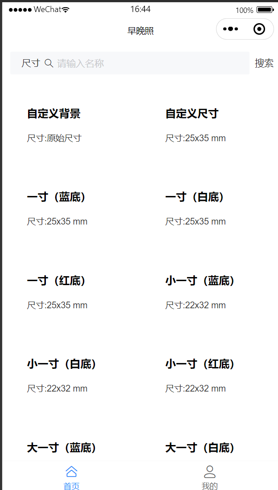
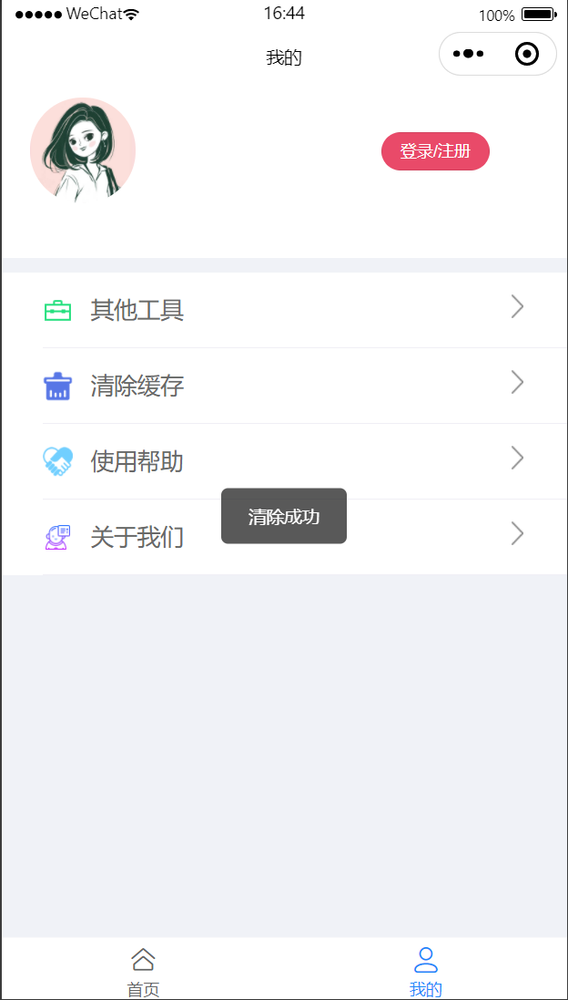
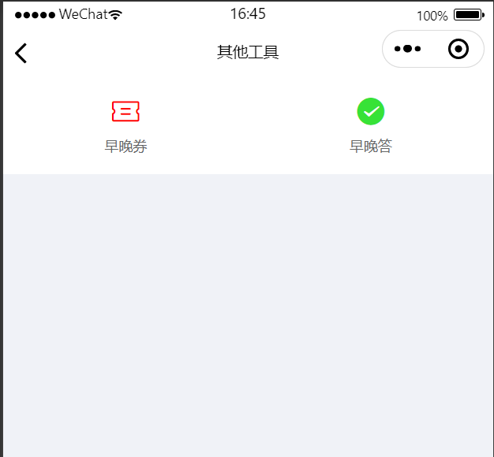
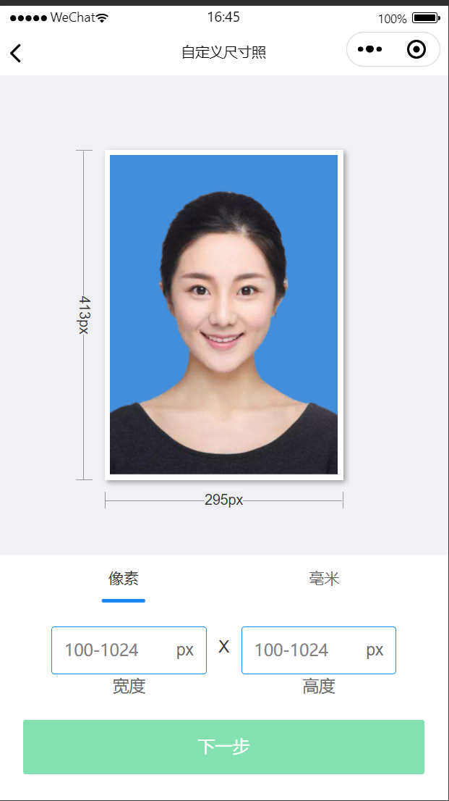
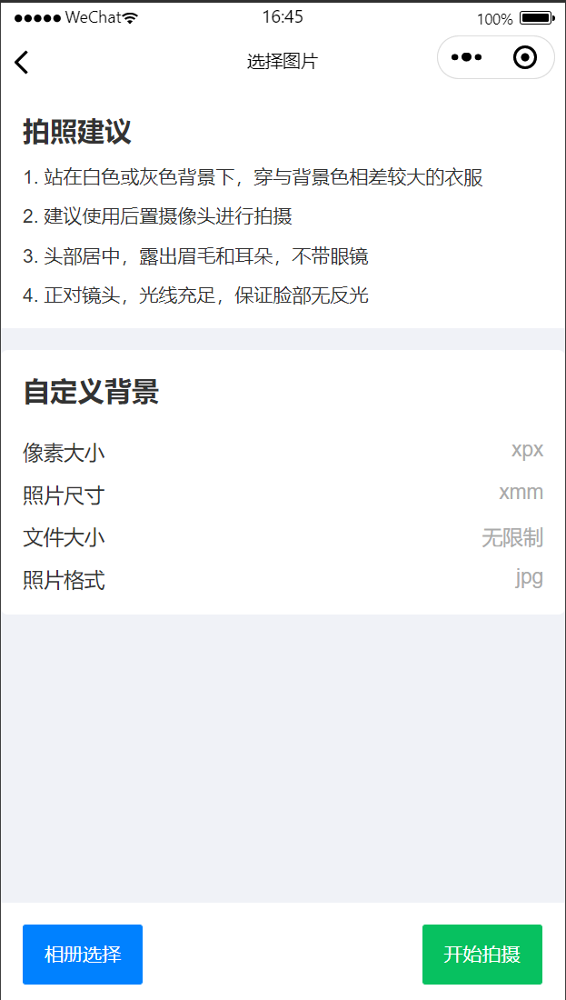

# 早晚照小程序

#### 介绍

AI 换底色，根据尺寸更换背景，生成证件照

交流 qq群：123955944

#### 扫码预览

**由于服务器性能有限，经常内存不足，预览可能出现接口异常的情况。。。**

#### 工具使用

> 小程序页面：微信小程序基础组件，vant开源组件

> 后端接口：图片处理程序为python

#### 待完成

1. 整体功能性测试及审核上线

#### 代码运行

1. `utils/constant.js` 里面配置上传文件的域名

#### 后台接口

  关注微信公众号“技术成就自我”，回复关键字“证件照”获得后台源码地址。

  

#### 扫码添加QQ群讨论

#### 微信群

#### 页面截图

